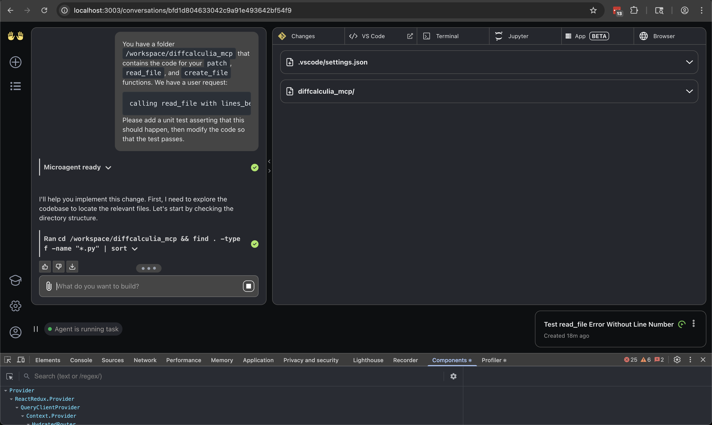
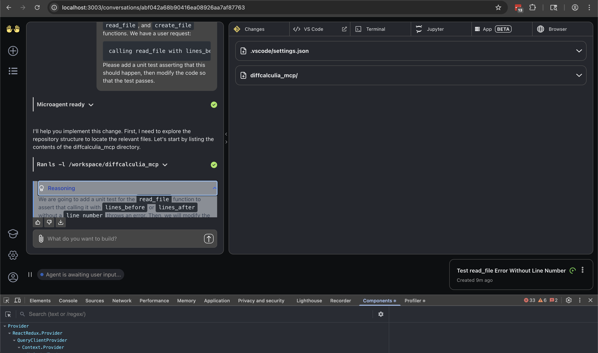

I recorded several conversations between Open Hands AI and llama.cpp running DeepSeek-R1-0528 671b:Q4_K_XL
using a tool called `mitmdump`. You can install it here: https://docs.mitmproxy.org/stable/overview/installation/

# jinja in llama.cpp

The `--jinja` CLI argument to `llama.cpp` changes the output. Without `--jinja`, we see `<think></think>` tags in
the `mitmdump` transcript. However, with `--jinja`, we see the output organized differently so that `reasoning_content`
is a JSON property in the output and we no longer see `<think>` tags.

However, with `--jinja` given on the CLI, I found R1 was far more likely to give `reasoning_content` with an empty
string for `content`. This caused the Open Hands AI session to halt.


# prompt

The prompt was:

````
You have a folder `/workspace/diffcalculia_mcp` that contains the code for your `patch`, `read_file`, and `create_file` functions. We have a user request:

```
calling read_file with lines_before and lines_after without a line_number should throw an error
```

Please add a unit test asserting that this should happen, then modify the code so that the test passes.
````

# Reason tags not showing in UI

On the `openhands/support-reasoning-content-ui` branch with no code patch applied and llama.cpp started
with no `--jinja` CLI argument:

`full_traffic_no_jinja_diffcalculia_mcp.mitm` shows a conversation where the `<think></think>` tags
did not show up as a collapsible Reasoning Content "tag" in the UI. You can view the conversation
transcript with:

```bash
mitmdump -nr full_traffic_no_jinja_diffcalculia_mcp.mitm --flow-detail 4
```

There is a screenshot of what this looks like in this file:


I then shut down Open Hands AI and applied this patch:
[open_hands_reasoning_content_print_only.diff](open_hands_reasoning_content_print_only.diff)

Then I started it back up again and ran another session, but I didn't see reasoning print statements in the log.


# Reason tags show up in UI when jinja added

Next, I shut down llama.cpp and started it back up with `--jinja`.


`full_traffic_jinja_diffcalculia_mcp_with_print.mitm` shows this conversation. You can view the transcript with:

```bash
mitmdump -nr full_traffic_jinja_diffcalculia_mcp_with_print.mitm --flow-detail 4
```

Screenshot:



